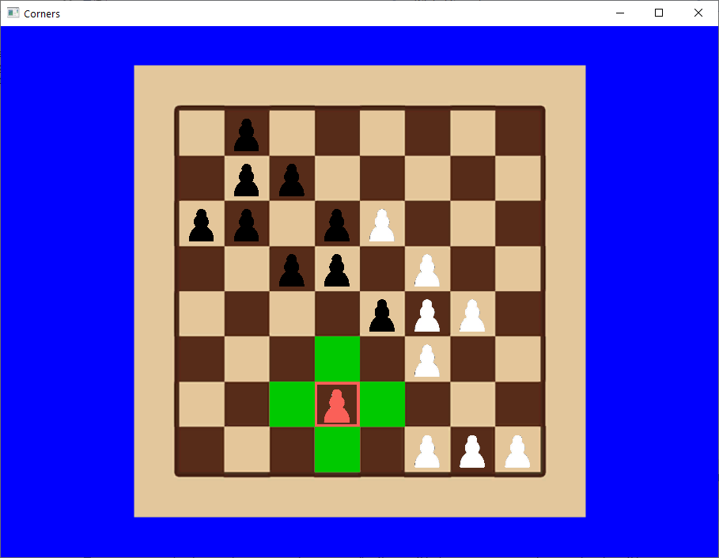
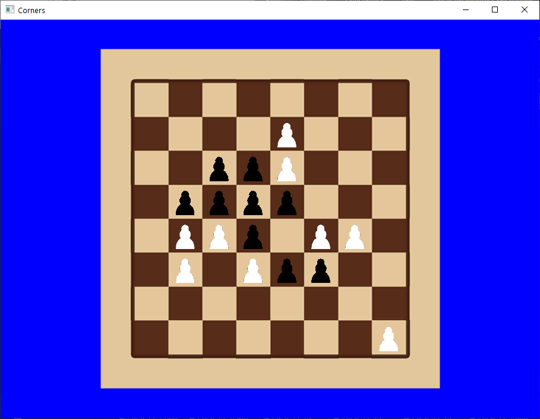

# Simple corners DirectX

## Реализация:
* Gui - DirectX11, Shader Model 5.0, C++
* Window - WinAPI
* AI - C++, MinMax
* Shaders - HLSL

Простые уголки. AI считает на шаг вперёд, однако в коде легко исправить глубину просчёта, место под это отведено. Автоматически меняет размер игровой доски,
оставаясь всегда квадратом, в зависимости от размера экрана.
Для запуска открыть студию (я использовал 19), скомпилировать проекты в Release(не тестировал)/Debug x64 и открыть из под студии, так как там настроены все пути(в папке с проектом текстуры и
шейдеры). 
Управление: нажать мышкой на белую фигуру (белые всегда ходят первые, игрок ходит только белыми) и по подсказкам выполнить ход.